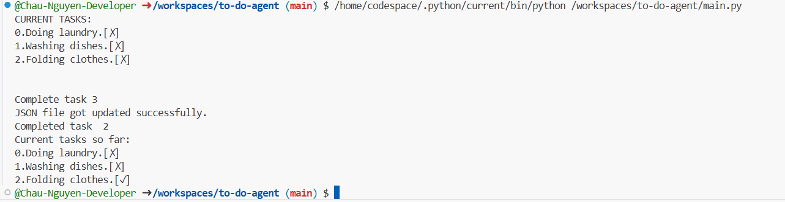

# to-do-agent

## What I learned:
1. When I add a task, I am only updating my Python variable in memory. At this point, the task is only in memory. When my program stops and if I do not save the changes back into .json file, the change will be lost. (aka the change is not reflected on my tasks.json file.)
2. So, that means, I have to write it back (aka save the updated list) to tasks.json on disk. Now, if the program closes, the new task will still exist when I reload and run my program next time. 
3. <b>Usually workflow:</b>
    * Load tasks from tasks.json and save the data into a Python object. 
    ```
    def load_tasks():
        try:
            with open("tasks.json", 'r', encoding='utf-8') as file:
                data = json.load(file)
                return data
        except FileNotFoundError:
            print("Error. File not found")
        except json.JSONDecodeError:
            print("Error. Could not decode JSON from file. Check if it is valid JSON file.")
    ```
    * Modify tasks by changing that Python object.
    ```
    add_task(myTask)
    remove_task(task_number)
    show_tasks()
    ``` 
    * Write/ dump that Python object back to tasks.json
    ```
        def save_tasks(myTask):
            with open("tasks.json", "w", encoding="utf-8") as file:
                json.dump(myTask, file, indent=4)
                print("Finished saving tasks.")
    ```
4. load/loads and dump/dumps
* json.load() -> read JSON directly from a file and convert it to Python objects (a dictionary/ a list)
* json.loads() -> read JSON from a string and the rest are the same with above
* json.dump() -> Take a Python object(ex: a list or dictionary) and write it as JSON to a file. 
* json.dumps() -> converts Python object to a JSON string in memory (does not write to file). Have to write to file manually later. 

```
tasks = [
    {"number: 1, "task": "Clean dishes", "done": False}
]
json_string=json.dumps(tasks, indent=4)

with open("tasks.json", "w", encoding="utf-8") as file:
    file.write(json_string)
```
Normally would use json.dump(). Only use json.dumps() when want to manipulate the JSON as string in memory first. 

## Update
(AKA the evolvement of features along the way)

### 09/09/2025. 
When a task is completed, that task will not disappear. Now, the completed-task wil have the tickmark next to it. 
I still need to work on the logic of the number. Number is sitll mixed up, as the array starts with index 0.  

 

